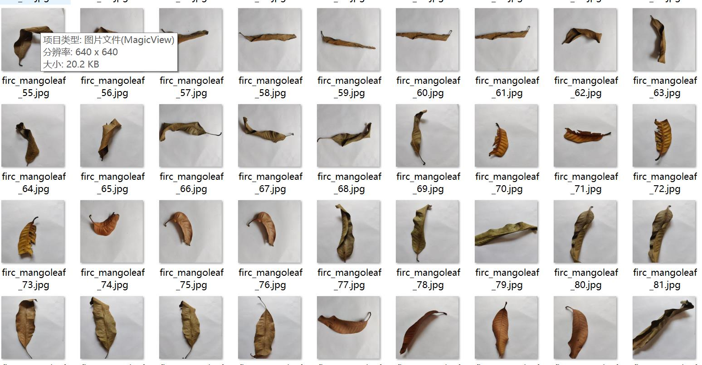
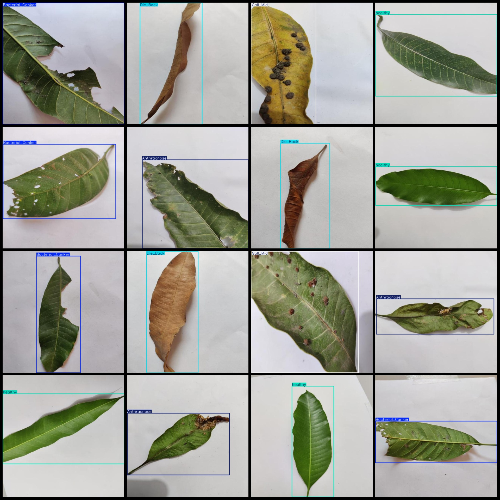
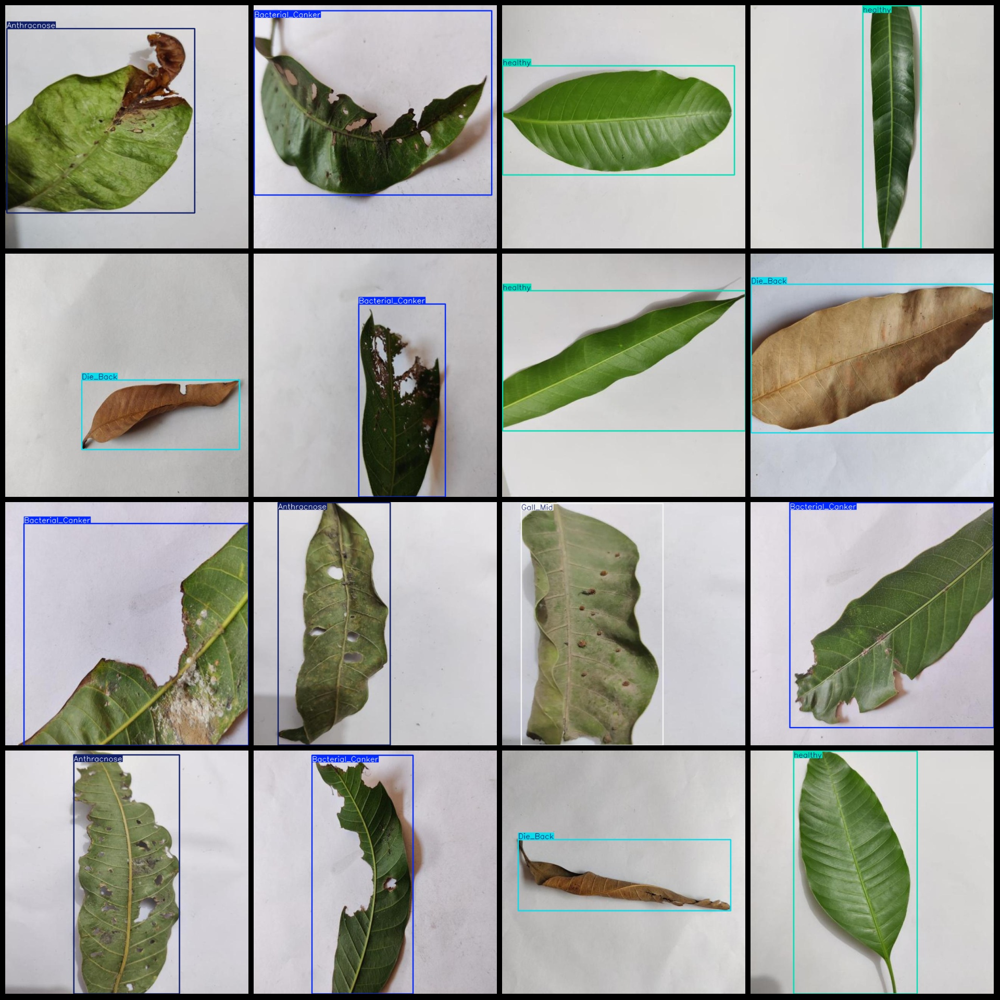

# Mango Leaf Disease Detection Dataset in VOC+YOLO format, 2925 images with 5 categories all single leaves

Note: There are a large number of augmented images in the dataset.

Dataset format: Pascal VOC format+YOLO format (without split path in txtfile, only containing jpg image and corresponding VOC format xmlfile and yolo format txtfile)

Number of images (jpg files): 2925
Number of annotations (xml files): 2925
Number of annotations (txt files): 2925
Number of annotation categories: 5
Annotation category names (Note: the order of classes in the yolo format corresponds to this, with reference to the classes.txt file in the labels folder): ["Anthracnose", "Bacterial Canker", "Die Back", "Gall Mid", "healthy"]

The number of annotations per category is:
- Anthraxcne (Anthrax) annotation = 618
- Bacterial Canker (Bacterial Canker) annotation = 577
- Die Back (Shoot Rot) annotation = 558
- Gall Mid (Gall Mid) annotation = 600
- Healthy (Healthy) annotation = 600
Total annotations = 2953

Number of images per category:
- Anthraxcne (Anthrax) = 592
- Bacterial_Canker (Bacterial canker) = 575
- Die_Back (Dieback) = 558
- Gall_Mid (Gall mid) = 600
- Healthy (Healthy) = 600

Image resolution: 640x640

Use the labeling tool: labelImg

Rule: Draw a box around the category.

Note: The dataset does not have a split into training, validation, and testing sets.

Special Disclaimer: This dataset does not guarantee the accuracy of the trained model or the weight files.

Image preview:
## Image

Here is a pay link on Stripe ( https://buy.stripe.com/3cs8yP7sY87d0vu9AB ). Please contact me lonlonago@foxmail.com after funding $89, and I will send you a complete data files , thank you!

